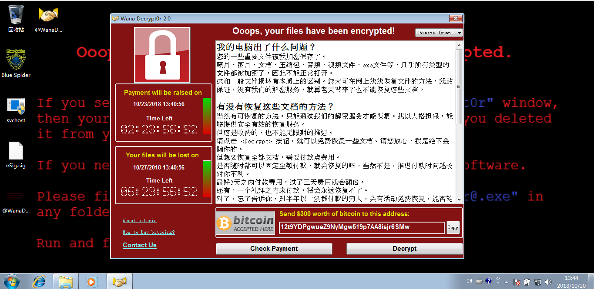

## 永恒之蓝样本（勒索病毒）

>  病毒名称(`Virus Name` ):  `WannaCrypt` ， `WannaCry`  ， `WanaCrypt0r` ， `WCrypt` ， `WCRY`

勒索病毒 `WannaCry` 借助高危漏洞“永恒之蓝” `(EternalBlue)` 在世界范围内爆发，据报道包括美国、英国、中国、俄罗斯、西班牙、意大利、越南等百余个国家均遭受大规模攻击。

**加密文件类型 `(The filetypes it looks for to encrypt are)` **

> `.doc, .docx, .xls, .xlsx, .ppt, .pptx, .pst, .ost, .msg, .eml, .vsd, .vsdx, .txt, .csv, .rtf, .123, .wks, .wk1, .pdf, .dwg, .onetoc2, .snt, .jpeg, .jpg, .docb, .docm, .dot, .dotm, .dotx, .xlsm, .xlsb, .xlw, .xlt, .xlm, .xlc, .xltx, .xltm, .pptm, .pot, .pps, .ppsm, .ppsx, .ppam, .potx, .potm, .edb, .hwp, .602, .sxi, .sti, .sldx, .sldm, .sldm, .vdi, .vmdk, .vmx, .gpg, .aes, .ARC, .PAQ, .bz2, .tbk, .bak, .tar, .tgz, .gz, .7z, .rar, .zip, .backup, .iso, .vcd, .bmp, .png, .gif, .raw, .cgm, .tif, .tiff, .nef, .psd, .ai, .svg, .djvu, .m4u, .m3u, .mid, .wma, .flv, .3g2, .mkv, .3gp, .mp4, .mov, .avi, .asf, .mpeg, .vob, .mpg, .wmv, .fla, .swf, .wav, .mp3, .sh, .class, .jar, .java, .rb, .asp, .php, .jsp, .brd, .sch, .dch, .dip, .pl, .vb, .vbs, .ps1, .bat, .cmd, .js, .asm, .h, .pas, .cpp, .c, .cs, .suo, .sln, .ldf, .mdf, .ibd, .myi, .myd, .frm, .odb, .dbf, .db, .mdb, .accdb, .sql, .sqlitedb, .sqlite3, .asc, .lay6, .lay, .mml, .sxm, .otg, .odg, .uop, .std, .sxd, .otp, .odp, .wb2, .slk, .dif, .stc, .sxc, .ots, .ods, .3dm, .max, .3ds, .uot, .stw, .sxw, .ott, .odt, .pem, .p12, .csr, .crt, .key, .pfx, .der`

“永恒之蓝”可远程攻击 `Windows` 的 `445` 端口(文件共享)，如果系统没有安装今年3月的微软补丁，无需用户任何操作，只要开机上网，“永恒之蓝”就能在电脑里执行任意代码，植入勒索病毒等恶意程序。

“永恒之蓝”传播的勒索病毒以 `ONION` 和 `WNCRY` 两个家族为主，受害机器的磁盘文件会被篡改为相应的后缀，图片、文档、视频、压缩包等各类资料都无法正常打开，只有支付赎金才能解密恢复。

本样本是以 `WNCRY` 家族，下图为病毒样式：

----2018.11.7更新----

对应的病毒反编译的 `C` 语言源码以及查杀工具源码在 `decryptor` 在 `source` 里面也提供了。以后有空再写分析一下这个源码该怎么写吧。